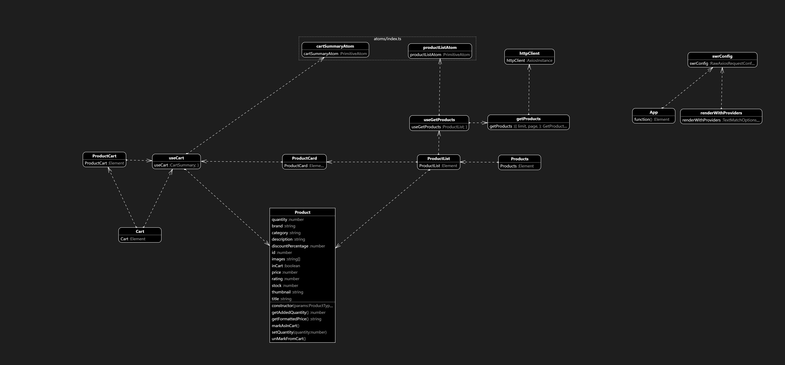

# e-Commerce com React Native

Este projeto foi desenvolvido com a finalidade de reproduzir um e-commerce simples focado em boas práticas de desenvolvimento.

### Arquitetura em UML



### Tecnologias

- TypeScript
- Expo;
- Axios;
- Jotai;
- React Navigation;
- Styled components;
- SWR;

### Requisitos

- Node v18.x (`No terminal use o comando nvm install 16`)
- NPM 6.x ou superior (`No terminal use o comando npm install -g npm@latest para atualizar`)

## Inicialização

1 - Execute comando `npm install`
2 - Execute o comando `npm run dev:expo`, se preferir utilizar a CLI, utilize o comando `npm run dev:cli`, lembre-se de executar `npx react-native start` em outro terminal para inicializar o Metro.

Observação: As blibliotecas dependentes como a `packages/ui-rn` não tem hot-reload ao executar o comando acima, para resolver em questão pode-se abrir um novo terminal e executar `npm run dev:[expo|cli]` na pasta da bliblioteca desejada, ou no root do repositório execute o comando `npm run dev[expo|cli]` para executar todas as aplicações/bibliotecas com hot-reload.

Crie um arquivo local `.env.local` e insira as variáveis, há um [exemplo de env](./.env.example). Como a variável da URL da API não é um dado sensível e não tem segmentos de ambientes(produção/homologação) pode-se copiar o de exemplo.

```bash
npm  install
npm run dev
```

## Outras documentações

- [Estrutura](./docs/structure.md)
- [Roadmap](./docs/roadmap.md)
- [Funcionalidades](./docs/features.md)
